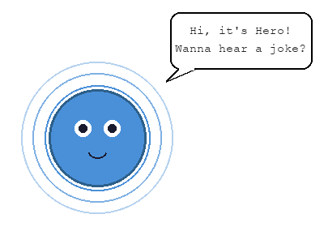

# Hero

<p align="center">
  
</p>

<p align="center">
  A local-first voice companion that runs entirely on-device. No cloud, no APIs, no data leaves your machine.
</p>

## How it works

Hero is a pipelined voice agent that listens, thinks, and speaks back — all locally on Apple Silicon.

```
┌─────────────┐   ┌─────────┐   ┌──────────────┐   ┌───────────┐
│ Mic capture │──▶│  VAD    │──▶│ ASR (Whisper)│──▶│    LLM    │
│ (sounddevice)│  │(Silero) │   │(faster-whisper)│  │  (Ollama) │
└─────────────┘   └─────────┘   └──────────────┘   └─────┬─────┘
                                                          │
       ┌──────────────────────────────────────────────────┘
       ▼
┌─────────────┐   ┌──────────┐   ┌──────────────┐
│   Memory    │──▶│   TTS    │──▶│   Widget     │
│(JSON file)  │   │ (Kokoro) │   │  (tkinter)   │
└─────────────┘   └──────────┘   └──────────────┘

┌──────────────┐
│   Vision     │── face/wave detection → gates pipeline + goodbye
│ (MediaPipe)  │
└──────────────┘
```

**Per-turn sequence:**

1. **Presence gate** — webcam checks for a face looking at the camera before Hero starts listening
2. **Mic + VAD** — streams audio in 512-sample chunks through Silero VAD; starts recording on speech, stops after 1s of silence
3. **ASR** — sends captured audio to faster-whisper (base model, int8 on CPU via CTranslate2)
4. **LLM** — sends transcript + conversation history to a local Ollama model with a companion persona system prompt
5. **Memory** — LLM emits `<remember>` tags for user facts (name, preferences); these are parsed, stripped from the spoken response, and saved to a JSON file. On next launch, memories are injected into the system prompt.
6. **TTS** — pipes the response through Kokoro (82M params, ONNX Runtime); audio amplitude is streamed to the widget for visualization
7. **Widget** — a Clippy-style floating transparent window that breathes when idle, widens eyes when listening, pulses with radiating rings when speaking, and shrinks away on goodbye

**Goodbye triggers:**
- Say "goodbye" or "bye" → Hero responds and exits
- Wave at the camera (sustained open palm ~1s) → Hero says goodbye and exits

## Tech stack

| Component | Library | Notes |
|-----------|---------|-------|
| Audio I/O | `sounddevice` | PortAudio wrapper, 16kHz mono |
| VAD | `silero-vad` | PyTorch, 512-sample chunks |
| ASR | `faster-whisper` | CTranslate2, ARM64 native |
| LLM | `ollama` | HTTP client to local server |
| Memory | JSON file | `data/memories.json`, gitignored |
| TTS | `kokoro` | ONNX Runtime, 24kHz output |
| Vision | `mediapipe` | FaceDetector + GestureRecognizer |
| Widget | `tkinter` | Borderless, transparent, always-on-top |

## Prerequisites

- macOS (Apple Silicon)
- Python 3.12+
- [Ollama](https://ollama.com) with a model pulled: `ollama pull llama3.2:1b`
- PortAudio: `brew install portaudio`

## Setup

```bash
python3 -m venv .venv
source .venv/bin/activate
pip install -e ".[dev]"
```

## Usage

```bash
python -m hero
```

Hero opens a small floating widget on your desktop. Look at the camera to start a conversation. Wave to say goodbye.

## Project structure

```
hero/
├── __main__.py          # Main loop, threading, state machine
├── config.py            # Pydantic settings
├── pipeline/
│   ├── mic.py           # VAD-triggered recording
│   ├── asr.py           # Whisper transcription
│   ├── llm.py           # Ollama + memory integration
│   ├── memory.py        # Long-term memory (JSON)
│   └── tts.py           # Kokoro TTS with amplitude streaming
├── vision/
│   └── presence.py      # Face detection + wave gesture
└── ui/
    └── widget.py        # Floating desktop widget
```

## Privacy

Everything runs locally. No audio, transcripts, or user data leaves your machine. The only network calls are to `localhost:11434` (Ollama). The GitHub repo contains source code only — all data files are gitignored.
